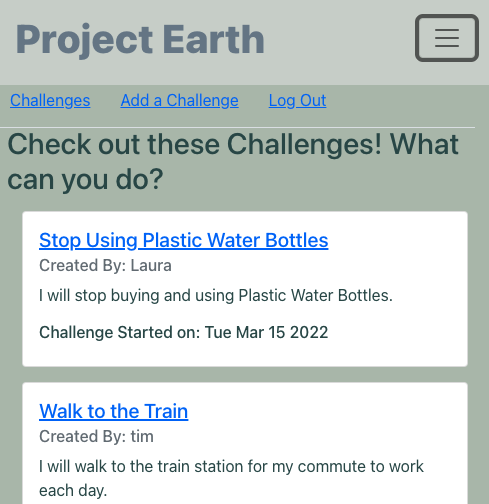
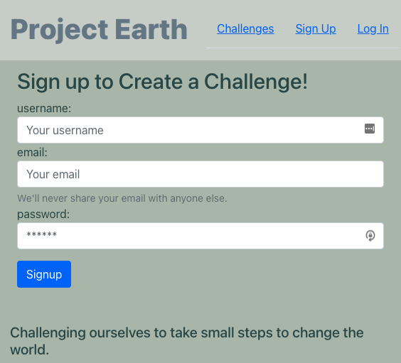

# ProjectEarth

## Description  

This project is a full stack React App focused on individual users making small commitments to incrementally improve how we interact with the environment. In addition to react, I used a Mongo database and mongoose and I used SASS, CSS, and some bootstrap components to style. The site is responsive and I used react hooks including react state to show the navigation and some errors differently based on changes of state. Sign Up today and make a challenge to commit yourself to do something to help our Earth today. 

[Project Earth](https://projectearthecochallenge.herokuapp.com/)

This is the Challenges Page to see ways others are challenging themselves to make a difference...

Then you can Sign Up...

And Make your own challenge.

## Table of Contents   

* [Usage](#usage)
* [Build](#Built)
* [Authors](#authors)
* [License](#license)
* [Questions](#questions)

## Usage 

This is a live site, so you can check it out for yourself! Just follow the link. 

[Live site: Project Earth!](https://projectearthecochallenge.herokuapp.com/)

## Built With

* [Javascript](https://developer.mozilla.org/en-US/docs/Web/JavaScript)
* [Express](https://www.npmjs.com/package/express)
* [bcrypt NPM](https://www.npmjs.com/package/bcrypt)
* [Create React App](https://create-react-app.dev/)
* [SASS](https://sass-lang.com/)
* [jwt-decode NPM](https://www.npmjs.com/package/jwt-decode)
* [React](https://reactjs.org/)
* [React Router](https://reactrouter.com/docs/en/v6)
* [MongoDB](https://www.mongodb.com/)
* [Mongoose](https://mongoosejs.com/docs/api.html)
* [CSS](https://www.w3.org/Style/CSS/Overview.en.html)
* [jsonwebtoken](https://www.npmjs.com/package/jsonwebtoken)
* [Cloud Atlas Cluster](https://www.mongodb.com/cloud/atlas)
* [Compass](https://www.mongodb.com/products/compass)
* [Insomnia](https://insomnia.rest/)
* [React-character-counter](https://www.npmjs.com/package/react-character-counter)
* [Bootstrap](https://getbootstrap.com/)
* [HTML](https://developer.mozilla.org/en-US/docs/Web/HTML)
* [Heroku](https://dashboard.heroku.com/apps)

## Authors

* **Laura Gupta** 

- [Link to Portfolio Site](https://lauragupta.github.io/lauraReactPortfolio/)
- [Link to Github](https://github.com/lauragupta?tab=repositories)
- [Link to LinkedIn](https://www.linkedin.com/in/laura-gupta-5a277158/)

## License
MIT License

Copyright (c) 2022 Laura Gupta

Permission is hereby granted, free of charge, to any person obtaining a copy
of this software and associated documentation files (the "Software"), to deal
in the Software without restriction, including without limitation the rights
to use, copy, modify, merge, publish, distribute, sublicense, and/or sell
copies of the Software, and to permit persons to whom the Software is
furnished to do so, subject to the following conditions:

The above copyright notice and this permission notice shall be included in all
copies or substantial portions of the Software.

THE SOFTWARE IS PROVIDED "AS IS", WITHOUT WARRANTY OF ANY KIND, EXPRESS OR
IMPLIED, INCLUDING BUT NOT LIMITED TO THE WARRANTIES OF MERCHANTABILITY,
FITNESS FOR A PARTICULAR PURPOSE AND NONINFRINGEMENT. IN NO EVENT SHALL THE
AUTHORS OR COPYRIGHT HOLDERS BE LIABLE FOR ANY CLAIM, DAMAGES OR OTHER
LIABILITY, WHETHER IN AN ACTION OF CONTRACT, TORT OR OTHERWISE, ARISING FROM,
OUT OF OR IN CONNECTION WITH THE SOFTWARE OR THE USE OR OTHER DEALINGS IN THE
SOFTWARE.

## Questions 
For questions, contact me at [GitHub](https://github.com/lauragupta) or email me at <codinglauragupta@gmail.com>
Thanks for reading!